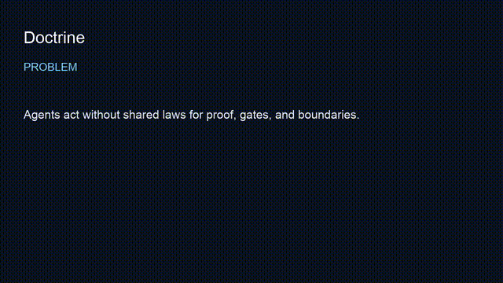

# doctrine

> Operating rules agents load before they act — proof standards, gates, and TAC-aligned constraints.
**Outcome:** `bash scripts/smoke.sh` verifies agents can load doctrine across 9 priority domains, 10 scenario contracts, 180 persona contracts, and 12 seed doctrine packages.


## Employer summary
Doctrine is the law layer for the studio fleet: what must be true before tools run, what counts as done, and what is forbidden on public surfaces.

## Proof in 60 seconds
```bash
git clone https://github.com/mrodgersjs-web/doctrine.git
cd doctrine
bash scripts/smoke.sh
find . -name '*.md' ! -path './.git/*' | head
```

## Public boundary
See [docs/public-boundary.md](docs/public-boundary.md).

---
Repository baseline and starter structure: [internal planning notes](docs/internal.md#rig-doctrine-repo).

## The 9 Priority Doctrine Domains

The current v10 doctrine baseline is organized around these domains:

1. Engineering Capability: proof-backed engineering delivery lanes, DoneContracts, GEV loops, tests, and proof gates.
2. App Building: build-card-to-working-slice app factory with UX, browser checks, backend, frontend, data, and release proof.
3. LinkedIn Studio: source-backed content generation, voice lint, claim maps, content calendar, and performance learning loops.
4. Communications: audience-routed messaging, clarity checks, follow-up logs, and channel doctrine.
5. RIG Mesh: LAN-first node routing, QNAP parity, worker receipts, nightly proof, and mesh health doctrine.
6. RIG IDE: doctrine-aware coding sessions, command palette contracts, repo-specific rule loading, and proof shortcuts.
7. RIG Instagram: visual, caption, asset provenance, brand checks, export state, reusable templates, and learning notes.
8. Go-To-Market: ICP, offer, channel, campaign experiment, CRM-ready action, and revenue learning loops.
9. Strategy Studio: future-back strategy memos, scenario branches, decision replay, capability maps, and next-slice doctrine updates.

Each domain should eventually have a full doctrine pack with:

- `README.md`
- `doctrine.yaml`
- `doctrine.md`
- `agent-pack.md`
- `done-contract.yaml`
- `test-plan.yaml`
- `source-map.yaml`
- `proofpacket.json`
- examples
- regression fixtures

## How Doctrine Promotion Works

RIG doctrine should move through a clear maturity path.

### v0: Raw Input

A raw input can be:

- Recall card.
- Build card.
- Mike-originated idea.
- Chat insight.
- Field lesson.
- QNAP document.
- GitHub issue or PR lesson.
- Client pattern.
- Market signal.
- Studio operating pattern.

At v0, the material is not yet doctrine. It is an input.

### v1: Doctrine Candidate

A candidate must have:

- A named doctrine idea.
- Source reference or human-origin marker.
- Initial problem statement.
- Initial rule or operating principle.
- Anti-patterns.
- First use cases.
- Confidence level.

### v5: Repeatable Workflow

A v5 doctrine has:

- A repeatable process.
- Known trigger conditions.
- Agent instructions.
- Test checklist.
- Expected outputs.
- Proof requirements.
- Failure modes.
- Promotion or retirement rules.

### v10: Agent-Loadable Operating Doctrine

A v10 doctrine has:

- Source evidence.
- Doctrine text.
- Agent pack.
- DoneContract.
- CLI and MCP access path.
- Tests.
- ProofPacket.
- QNAP and GitHub parity evidence.
- Cockpit visibility.
- Version history.
- Retirement and update policy.

The standard is simple: if an agent cannot load it, apply it, test against it, and emit proof for it, it is not v10 doctrine.

## How To Use This Repo

### 1. Use It In An AI Coding Session

At the start of a coding session, tell the agent:

```text
Load the RIG Doctrine Repo. Follow the relevant doctrine packs for this task. Before implementation, identify the controlling doctrine, DoneContract, proof requirements, and test plan. Do not claim PASS without inspectable proof.
```

The agent should then:

1. Identify the domain.
2. Load the matching doctrine pack.
3. State assumptions and scope.
4. Create or reference a DoneContract.
5. Implement only the requested slice.
6. Run tests and verification.
7. Emit a ProofPacket.
8. Report what works, what does not, and the next safe step.

### 2. Use It With Codex

For Codex, this repo should become a pullable doctrine layer:

```text
Use RIG Doctrine Repo as the controlling doctrine source. For this task, apply Engineering Capability, App Building, and RIG Build Doctrine. Show the proof path before final.
```

Codex should be able to use this repo to answer:

- What rules govern this build?
- What does done mean?
- What tests are required?
- What proof is required?
- What should not be touched?
- What should be promoted back into doctrine after the work?

### 3. Use It With Claude Or Other Agents

Agents should consume `agent-packs/` first, then load deeper doctrine only when needed.

The target agent-loading order is:

1. Repo-level `AGENTS.md` or equivalent.
2. Task-specific doctrine pack.
3. DoneContract.
4. Test plan.
5. ProofPacket schema.
6. Source map.
7. Examples.

This keeps the session grounded without flooding the model with every doctrine at once.

### 4. Use It With A CLI

The future CLI should support commands like:

```bash
rig-doctrine list
rig-doctrine show engineering-capability
rig-doctrine agent-pack app-building
rig-doctrine assess intake/my-new-idea.md
rig-doctrine promote intake/my-new-idea.md --domain strategy-studio
rig-doctrine proof latest
rig-doctrine export --format mcp
```

The CLI should return machine-readable JSON by default when requested:

```bash
rig-doctrine list --json
rig-doctrine show rig-build-doctrine --json
rig-doctrine assess intake/card.md --json
```

### 5. Use It With MCP

The future MCP server should expose doctrine as callable tools:

```text
rig.doctrine.list
rig.doctrine.get
rig.doctrine.agent_pack
rig.doctrine.assess
rig.doctrine.promote
rig.doctrine.proofpacket
rig.doctrine.search
rig.doctrine.context_for_task
```

MCP parity rule:

Every MCP tool must have a matching CLI behavior, schema, and regression test.

### 6. Use It With QNAP

QNAP should act as the durable data plane and mirror, not as the only source of truth.

Target pattern:

1. GitHub stores canonical versioned doctrine.
2. QNAP stores mirrored vault state, raw intake, snapshots, and heavy artifacts.
3. CLI validates parity between GitHub and QNAP.
4. Nightly job emits sync proof.
5. Drift creates a visible warning, not silent failure.

### 7. Use It With GitHub Repos

Any RIG repo should be able to include a pointer like:

```text
This repo follows RIG Doctrine Repo:
- Engineering Capability
- RIG Build Doctrine
- App Building
- ProofPacket standard
```

Agents should use that pointer to load relevant doctrine before coding.

## Minimum Doctrine Pack Contract

Every doctrine pack should eventually satisfy this contract:

```yaml
id: rig-doctrine-example
name: Example Doctrine
version: 0.1.0
status: candidate
domain: engineering-capability
owner: Mike Rodgers
source_policy:
  requires_source_per_claim: true
  allowed_source_types:
    - recall_card
    - build_card
    - github_commit
    - qnap_artifact
    - human_origin
agent_usage:
  load_when:
    - task touches the relevant domain
    - user explicitly asks for RIG doctrine
  required_outputs:
    - controlling_doctrine
    - done_contract
    - proofpacket
quality_gates:
  - tests_pass
  - proof_paths_exist
  - no_hidden_assumptions
  - rollback_or_blocker_path_exists
promotion:
  v0: raw input
  v1: candidate
  v5: repeatable workflow
  v10: agent-loadable operating doctrine
```

## Proof Standard

RIG doctrine should not accept vague claims.

Every meaningful PASS claim should include:

- Objective.
- Changed surfaces.
- Commands run.
- Test results.
- Proof paths.
- Known failures.
- Rollback or blocker path.
- Confidence level.
- Verifier receipt when the work is non-trivial.

If the work cannot be verified, the correct status is not PASS. It is one of:

- planned
- candidate
- partial
- blocked
- failed
- needs verifier

## Current v10 Baseline

The current RIG Vault v10 baseline has:

- 9 domains.
- 10 Mike-use scenario contracts.
- 180 client persona contracts.
- 1,800 client-facing good criteria.
- 900 client process KPIs.
- 900 client outcome KPIs.
- 9 generated domain packages.
- CLI surface for doctrine-v10 commands.
- MCP-compatible calls through the current RIG CLI path.
- Cockpit data.
- QNAP nightly proof.
- Unit test proof.

This repo should turn that baseline into a portable doctrine repository.

Long-range design and implementation roadmap: [internal planning notes](docs/internal.md#what-a-1000x-better-version-looks-like).

## How To Contribute Doctrine

1. Add raw material to `intake/`.
2. Create a doctrine candidate.
3. Add source references.
4. Add expected agent behavior.
5. Add test fixtures.
6. Add proof requirements.
7. Run validation.
8. Promote only after proof.

Do not merge doctrine because it sounds good. Merge it because it improves agent behavior, build quality, user outcomes, or operating clarity and can be verified.

## Operating Principle

RIG doctrine should make good work easier to repeat.

If a doctrine does not help an agent or human make a better decision, build a better system, avoid a known failure, or produce stronger proof, it should be rewritten, retired, or kept out of the canonical layer.


---


## Video walkthrough

- Script: [`docs/video-script.md`](docs/video-script.md)
- Recording: [`assets/demo.mp4`](assets/demo.mp4) (75s captioned)
- Preview: [`assets/demo.gif`](assets/demo.gif)



## FDE bar (this studio)

| Practice | Here |
| --- | --- |
| Employer summary | top of README |
| Smoke proof | `bash scripts/smoke.sh` |
| Public boundary | `docs/public-boundary.md` |
| Claim under test | doctrine markdown present |
| Fleet | [profile](https://github.com/mrodgersjs-web) · [resume](https://github.com/mrodgersjs-web/resume) · [patents](https://github.com/mrodgersjs-web/patents) |

If `scripts/smoke.sh` fails, treat README claims as false until fixed.
